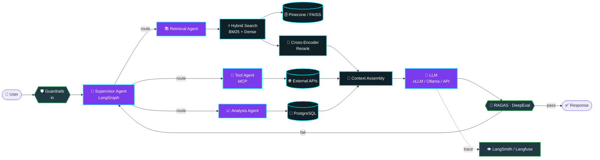

<!-- ═══════════════════════ HEADER ═══════════════════════ -->
<div align="center">
  
</div>

<div align="center">
  <a href="https://kukilbharadwaj.netlify.app">
    
  </a>
</div>

<div align="center">
  <a href="https://linkedin.com/in/kukil-bharadwaj"></a>
  <a href="https://kukilbharadwaj.netlify.app"></a>
  <a href="mailto:kukilbharadwaj24@gmail.com"></a>
  <a href="https://github.com/Kukilbharadwaj"></a>
  <br/>
  
  
  
</div>


<!-- ═══════════════════════ ABOUT ═══════════════════════ -->
##  &nbsp;`whoami`

<table>
<tr>
<td width="58%" valign="top">

I'm an **AI Engineer** who ships LLM systems that survive contact with real users — not notebooks.

- 🧠 &nbsp;Specialize in **RAG pipelines** and **multi-agent architectures** running in production
- 🌏 &nbsp;Built a **multilingual hybrid RAG** chatbot → **60% → 85%** query resolution, **−45%** human escalations
- ⚡ &nbsp;Obsessed with the unglamorous half: **evals, guardrails, latency, observability**
- 📄 &nbsp;Published researcher — **ICSSSM-2025 (Atlantis Press)**
- 🏆 &nbsp;**Top 5 / 200+ teams** — Google GenAI Exchange Hackathon 2024
- 🎯 &nbsp;Currently going deep on **MCP tool-calling**, **voice agents (Pipecat)** and **LoRA fine-tuning**
- 📬 &nbsp;Reach me → **kukilbharadwaj24@gmail.com**

</td>
<td width="42%" valign="top">


</td>
</tr>
</table>

```python
class KukilBharadwaj:
    role      = "AI Engineer"
    location  = "Bengaluru, IN"
    focus     = ["RAG", "Agentic AI", "LLM Serving", "Evals"]

    def stack(self) -> dict:
        return {
            "orchestration": ["LangGraph", "LangChain", "CrewAI", "MCP"],
            "retrieval":     ["Pinecone", "FAISS", "ChromaDB", "BM25 Hybrid"],
            "serving":       ["FastAPI", "vLLM", "Ollama", "Docker", "Redis"],
            "quality":       ["RAGAS", "DeepEval", "LangSmith", "Guardrails"],
        }

    def build(self, problem):
        while not problem.solved:
            problem.retrieve().reason().act().evaluate()   # measure, then ship
        return "production"
```


<!-- ═══════════════════════ ARCHITECTURE ═══════════════════════ -->
## 🧬 &nbsp;How I Architect an AI System

> The diagram below is live Mermaid — it renders natively on GitHub. This is the reference shape of the agentic RAG stack I build.




<!-- ═══════════════════════ STACK ═══════════════════════ -->
## ⚙️ &nbsp;Tech Arsenal

<div align="center">


<br/><br/>

**🧠 LLM & Agentic AI**


**🔍 Retrieval & Vector Search**


**🧪 Evaluation, Guardrails & Observability**


**🏗️ Model Development & Serving**


</div>


<!-- ═══════════════════════ PROJECTS ═══════════════════════ -->
## 🚀 &nbsp;Featured Work

<div align="center">
  <a href="https://github.com/Kukilbharadwaj/AetherCare">
    
  </a>
  <a href="https://github.com/Kukilbharadwaj/FinSage">
    
  </a>
</div>

<details open>
<summary><b>🏥 &nbsp;AetherCare — Multimodal Hospital AI Assistant</b></summary>

<br/>

> Production-ready hospital assistant orchestrating real hospital APIs through an agent graph — appointments, symptom-driven doctor discovery, labs, pharmacy and patient support.

| | |
|---|---|
| **Stack** | `LangGraph` `Pipecat` `MCP Tool-Calling` `Guardrails` `LangSmith` `FastAPI` |
| **Highlight** | **sub-4s p99** response latency across multi-tool reasoning chains |
| **Why it's hard** | Voice + text multimodality, tool fan-out, and safety gates on medical intent |

</details>

<details>
<summary><b>💹 &nbsp;FinSage — Multi-Agent Financial Intelligence System</b></summary>

<br/>

> A LangGraph multi-agent system that fuses live market data, financial rule APIs and RAG pipelines via MCP tool-calling for real-time investment intelligence.

| | |
|---|---|
| **Stack** | `LangGraph` `MCP` `RAG` `Market Data APIs` `FastAPI` |
| **Highlight** | **90% task-completion accuracy** on multi-step reasoning |
| **Why it's hard** | Chaining price → technical indicators → financial context without hallucinating numbers |

</details>

<details>
<summary><b>🌾 &nbsp;Multilingual Hybrid RAG Support Assistant</b> <i>(Arodos Technologies)</i></summary>

<br/>

> Hybrid retrieval chatbot serving **10K+ monthly queries** in multiple languages, evaluated continuously with RAGAS.

| | |
|---|---|
| **Stack** | `BM25 + Pinecone Hybrid` `PostgreSQL` `RAGAS` `LangChain` `GCP` |
| **Highlight** | Resolution **60% → 85%**, human escalations **−45%** |
| **Why it's hard** | Multilingual embeddings + sparse/dense fusion tuned against a real eval set |

</details>

<details>
<summary><b>📄 &nbsp;LLM Document Intelligence Pipeline</b> <i>(Arodos Technologies)</i></summary>

<br/>

> End-to-end pipeline for unstructured PDFs — guided data capture, validation and auto-filling, powered by a LoRA fine-tune.

| | |
|---|---|
| **Stack** | `LoRA / Unsloth` `FastAPI` `AWS` `PostgreSQL` |
| **Highlight** | **+40% workflow efficiency**; led development end-to-end |
| **Why it's hard** | Layout-noisy PDFs → structured, human-verifiable output |

</details>

<details>
<summary><b>🔎 &nbsp;LLM-Enabled ERP Semantic Search</b> <i>(Vasp Technologies)</i></summary>

<br/>

> Semantic search across ERP data, shipped as Dockerized microservices with CI/CD.

| | |
|---|---|
| **Stack** | `LangChain` `Docker` `FastAPI` `PostgreSQL` |
| **Highlight** | **sub-1s** search latency · support chatbot cut resolution time **25%** |
| **Bonus** | Real-time face-recognition attendance (PyTorch + OpenCV) for **200+ students**, errors **−50%** |

</details>


<!-- ═══════════════════════ IMPACT ═══════════════════════ -->
## 📈 &nbsp;Impact, In Numbers

<div align="center">

| 🎯 Metric | 📊 Result | 🧩 Where |
|:---|:---:|:---|
| Chatbot query resolution | **60% → 85%** | Multilingual Hybrid RAG |
| Human-escalated support queries | **−45%** | Multilingual Hybrid RAG |
| Monthly queries served | **10K+** | Production, GCP |
| Agentic response latency | **sub-4s p99** | AetherCare |
| Multi-step task completion | **90%** | FinSage |
| Document workflow efficiency | **+40%** | LoRA doc pipeline |
| ERP semantic search latency | **<1s** | Dockerized microservices |
| Manual tracking effort | **−55%** | Analytics platform, 150+ users |
| Hackathon rank | **Top 5 / 200+** | Google GenAI Exchange 2024 |

</div>


<!-- ═══════════════════════ RESEARCH ═══════════════════════ -->
## 🏆 &nbsp;Research & Recognition

<table>
<tr>
<td width="50%" valign="top">

### 📜 Publication
**Dyslexia Chatbot Architecture Using RL-based Seq2Seq Model**
<br/>*ICSSSM-2025 · Atlantis Press*

Designed and evaluated a therapeutic Seq2Seq chatbot enhanced with reinforcement learning across **500+ test samples**.

</td>
<td width="50%" valign="top">

### 🥇 Google GenAI Exchange Hackathon 2024
**Top 5 out of 200+ teams**

Built an AI-driven conversational agent to make insurance more accessible, for **PolicyBazaar**.

</td>
</tr>
</table>

<div align="center">
  
</div>


<!-- ═══════════════════════ STATS ═══════════════════════ -->
## 📊 &nbsp;GitHub Analytics

<div align="center">


<br/>


<br/><br/>


</div>

### 🐍 &nbsp;Contribution Snake

<div align="center">
  <picture>
    <source media="(prefers-color-scheme: dark)" srcset="https://raw.githubusercontent.com/Kukilbharadwaj/Kukilbharadwaj/output/snake-dark.svg"/>
    <source media="(prefers-color-scheme: light)" srcset="https://raw.githubusercontent.com/Kukilbharadwaj/Kukilbharadwaj/output/snake.svg"/>
    
  </picture>
</div>


<!-- ═══════════════════════ CONNECT ═══════════════════════ -->
## 🤝 &nbsp;Let's Build Something

<div align="center">

**Open to AI Engineer / LLM Engineer roles — available for immediate joining.**

<a href="mailto:kukilbharadwaj24@gmail.com"></a>
<a href="https://linkedin.com/in/kukil-bharadwaj"></a>
<a href="https://kukilbharadwaj.netlify.app"></a>

<br/><br/>


</div>


<div align="center"><sub>⭐ If any of this is useful to you, a star or a hello is always welcome.</sub></div>
