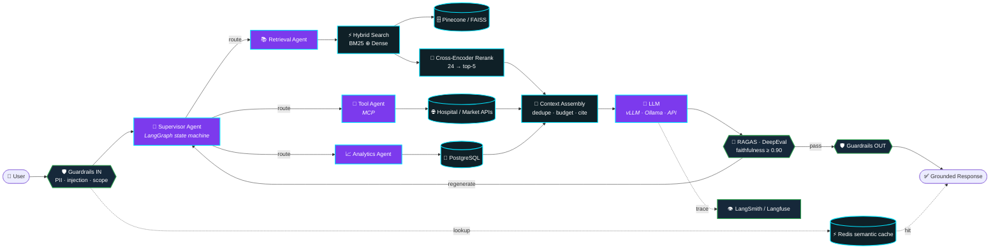
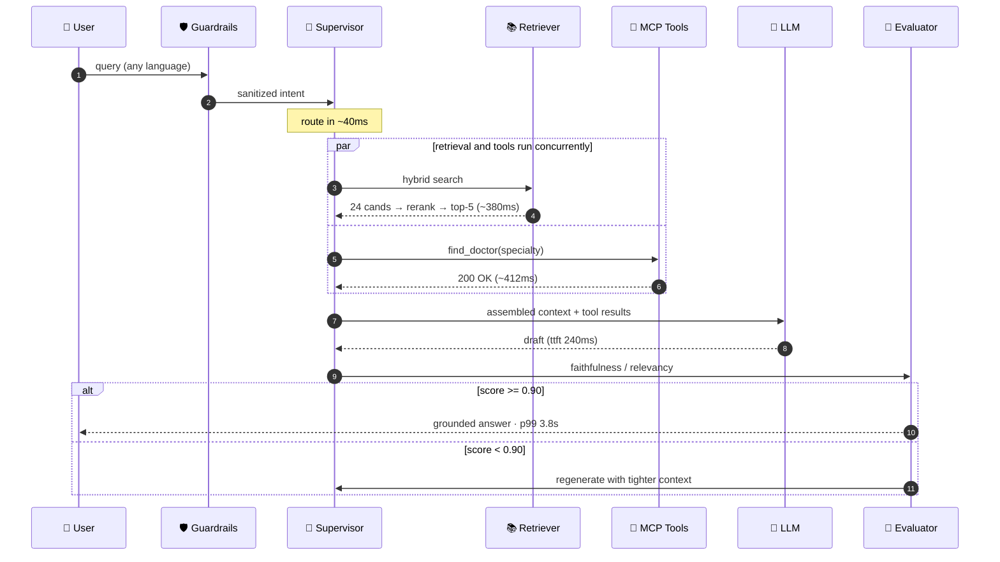
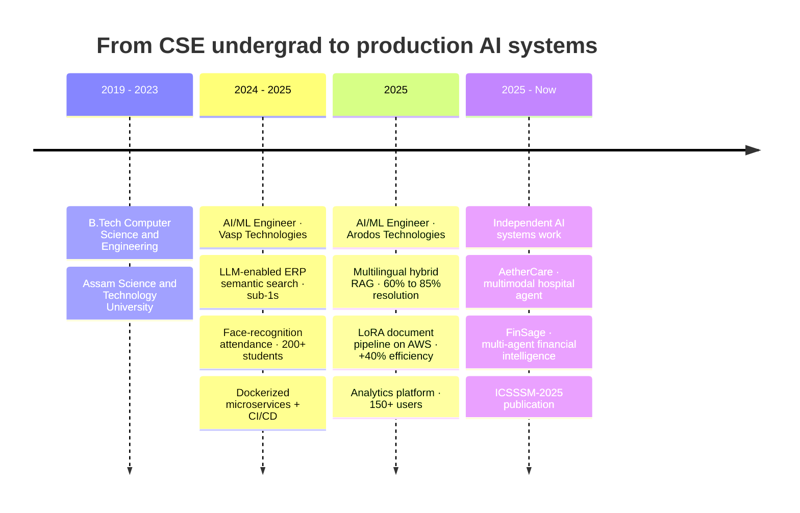

<!-- ══════════════════════════════ HERO ══════════════════════════════ -->
<div align="center">
  
</div>

<div align="center">
  <a href="https://linkedin.com/in/kukil-bharadwaj"></a>
  <a href="https://kukilbharadwaj.netlify.app"></a>
  <a href="mailto:kukilbharadwaj24@gmail.com"></a>
  <a href="https://github.com/Kukilbharadwaj?tab=repositories"></a>
  
</div>

<div align="center">
  <sub>
    <a href="#-whoami"><b>whoami</b></a> &nbsp;·&nbsp;
    <a href="#-how-i-architect-ai-systems"><b>architecture</b></a> &nbsp;·&nbsp;
    <a href="#️-anatomy-of-one-agent-turn"><b>agent loop</b></a> &nbsp;·&nbsp;
    <a href="#️-tech-arsenal"><b>stack</b></a> &nbsp;·&nbsp;
    <a href="#-featured-work"><b>work</b></a> &nbsp;·&nbsp;
    <a href="#-impact-in-numbers"><b>impact</b></a> &nbsp;·&nbsp;
    <a href="#-research--recognition"><b>research</b></a> &nbsp;·&nbsp;
    <a href="#-lets-build-something"><b>contact</b></a>
  </sub>
</div>


<!-- ══════════════════════════════ ABOUT ══════════════════════════════ -->
##  &nbsp;`whoami`

<table>
<tr>
<td width="57%" valign="top">

I'm an **AI Engineer** who ships LLM systems that survive contact with real users — not notebooks.

Most of my work lives in the gap between *"the demo works"* and *"10,000 people used it this month."* That gap is retrieval quality, tool reliability, latency budgets, guardrails and honest evals.

- 🧠 &nbsp;**RAG pipelines** & **multi-agent architectures** in production
- 🌏 &nbsp;Multilingual hybrid RAG → **60% → 85%** resolution, **−45%** escalations
- ⚡ &nbsp;Obsessed with the unglamorous half: **evals, guardrails, latency, tracing**
- 📄 &nbsp;Published researcher — **ICSSSM-2025 · Atlantis Press**
- 🏆 &nbsp;**Top 5 / 200+ teams** — Google GenAI Exchange Hackathon 2024
- 🔭 &nbsp;Going deep on **MCP tool-calling**, **voice agents (Pipecat)**, **LoRA fine-tuning**
- 📬 &nbsp;**kukilbharadwaj24@gmail.com**

</td>
<td width="43%" valign="top">


</td>
</tr>
</table>

```python
from dataclasses import dataclass, field

@dataclass
class KukilBharadwaj:
    role:     str  = "AI Engineer"
    based_in: str  = "Bengaluru, India"
    focus:    list = field(default_factory=lambda: ["RAG", "Agentic AI", "Serving", "Evals"])

    stack = {
        "orchestration": ["LangGraph", "LangChain", "CrewAI", "MCP"],
        "retrieval":     ["Pinecone", "FAISS", "ChromaDB", "BM25 hybrid", "cross-encoder"],
        "serving":       ["FastAPI", "vLLM", "Ollama", "Docker", "Redis"],
        "quality":       ["RAGAS", "DeepEval", "LangSmith", "Langfuse", "Guardrails"],
    }

    def build(self, problem):
        while not problem.solved:                        # ship > speculate
            problem.retrieve().rerank().reason().act()
            if problem.eval_score < 0.90:
                continue                                 # measure, then iterate
        return "production"
```


<!-- ══════════════════════════════ ARCHITECTURE ══════════════════════════════ -->
## 🧬 &nbsp;How I Architect AI Systems

> Rendered live by GitHub's Mermaid engine — this is the reference shape of the agentic RAG stack I build and run.




<!-- ══════════════════════════════ AGENT TURN ══════════════════════════════ -->
## ⏱️ &nbsp;Anatomy of One Agent Turn

<div align="center">
  
</div>

<details>
<summary><b>🔬 &nbsp;See the same turn as a sequence diagram — where the latency budget actually goes</b></summary>

<br/>



**Design rules I hold to:** parallelize every independent I/O · cap the context budget before the model sees it · never let an eval failure reach the user · trace every span, or you're debugging blind.

</details>


<!-- ══════════════════════════════ STACK ══════════════════════════════ -->
## ⚙️ &nbsp;Tech Arsenal

<div align="center">


<br/><br/>

<table>
<tr>
<td valign="top" width="50%">

**🧠 LLM & Agentic AI**


</td>
<td valign="top" width="50%">

**🔍 Retrieval & Vector Search**


</td>
</tr>
<tr>
<td valign="top">

**🧪 Evals, Guardrails & Observability**


</td>
<td valign="top">

**🏗️ Model Development & Serving**


</td>
</tr>
</table>

</div>


<!-- ══════════════════════════════ PROJECTS ══════════════════════════════ -->
## 🚀 &nbsp;Featured Work

<table>
<tr>
<td width="50%" valign="top">

### 🏥 [AetherCare](https://github.com/Kukilbharadwaj/AetherCare)
**Multimodal hospital AI assistant** — orchestrates appointment scheduling, patient verification, lab reports, admissions, pharmacy and symptom-based doctor discovery through natural conversation.

     

`sub-4s p99` &nbsp;·&nbsp; 

</td>
<td width="50%" valign="top">

### 💹 [FinSage](https://github.com/Kukilbharadwaj/FinSage-Multi-Agent-Financial-Intelligence-System)
**Multi-agent financial intelligence** — real-time insight across stocks, mutual funds, taxation, salary planning, insurance, loans and retirement, grounded in live market data.

    

`90% task completion` &nbsp;·&nbsp; 

</td>
</tr>
<tr>
<td width="50%" valign="top">

### 🧰 [WINDLASS](https://github.com/Kukilbharadwaj/WINDLASS)
**A framework, not a demo** — modular Python framework for production AI apps: LLM agents, RAG pipelines, MCP, tool calling, guardrails, evaluation and observability behind one extensible API.

   

`framework` &nbsp;·&nbsp; 

</td>
<td width="50%" valign="top">

### ☎️ [Phonecall Voice Agent](https://github.com/Kukilbharadwaj/Phonecall_Voice_Agent)
**Real-time voice AI over the phone** — full duplex pipeline with VAD, streaming STT, LLM and TTS, wired to live telephony.

    

`real-time` &nbsp;·&nbsp; 

</td>
</tr>
</table>

<details>
<summary><b>🗂️ &nbsp;More from the lab</b></summary>

<br/>

| Repo | What it is |
|:---|:---|
| [**AstraQuery**](https://github.com/Kukilbharadwaj/AstraQuery-AI-Powered-Natural-Language-Analytics-Engine) | Multi-agent NL→SQL pipeline — plain-English querying with generation, validation and AI-driven result analysis |
| [**Vectorless-RAG**](https://github.com/Kukilbharadwaj/Vectorless-RAG) | RAG without embeddings or a vector DB — LLM-powered contextual retrieval |
| [**CryptoSense**](https://github.com/Kukilbharadwaj/CryptoSense-Multi-Agent-Crypto-Intelligence-System) | Multi-agent crypto intelligence with real-time LLM analysis |
| [**HybridRAG**](https://github.com/Kukilbharadwaj/HybridRAG) | Hybrid sparse + dense retrieval experiments |
| [**Medical Report Analyzer**](https://github.com/Kukilbharadwaj/Medical_Report_Analyzer) | Automated medical report analysis, summarization and clinical insight extraction |
| [**Data-Analysis-Multi-Agent**](https://github.com/Kukilbharadwaj/Data-Analysis-Multi-Agent) | Agentic data-analysis workflows |
| [**PolicyGen**](https://github.com/Kukilbharadwaj/policy-gen) | The Google GenAI Hackathon Top-5 build — personalized insurance guidance |
| [**3D Object Detection**](https://github.com/Kukilbharadwaj/3D-OBJECT-DETECTION-USING-YOLO-ALGORITHM-ON-LIDAR-DATASET) · [**SAM2 Zero-Shot**](https://github.com/Kukilbharadwaj/zero-shot-object-detection-using-sam2) · [**Brain Tumor Detection**](https://github.com/Kukilbharadwaj/brain_tumor_detection) | Computer-vision work — LiDAR 3D detection, zero-shot segmentation, medical imaging |

</details>

### 💼 &nbsp;Shipped in Production

<details>
<summary><b>🌏 &nbsp;Multilingual Hybrid RAG Support Assistant</b> &nbsp;<code>10K+ queries/mo</code> &nbsp;<i>· Arodos</i></summary>

<br/>

> Hybrid retrieval chatbot serving **10K+ monthly queries** across languages, evaluated continuously with RAGAS.

| | |
|---|---|
| **Stack** | `BM25 + Pinecone hybrid` · `PostgreSQL` · `RAGAS` · `LangChain` · `GCP` |
| **Result** | Resolution **60% → 85%** · human escalations **−45%** |
| **Hard part** | Multilingual embeddings + sparse/dense fusion tuned against a real eval set, not vibes |

</details>

<details>
<summary><b>📄 &nbsp;LLM Document Intelligence Pipeline</b> &nbsp;<code>+40% efficiency</code> &nbsp;<i>· Arodos</i></summary>

<br/>

> End-to-end pipeline for unstructured PDFs — guided data capture, validation and auto-filling, powered by a LoRA fine-tune.

| | |
|---|---|
| **Stack** | `LoRA / Unsloth` · `FastAPI` · `AWS` · `PostgreSQL` |
| **Result** | **+40% workflow efficiency** · led development end-to-end |
| **Hard part** | Layout-noisy PDFs → structured, human-verifiable output with a review loop |

</details>

<details>
<summary><b>🔎 &nbsp;LLM-Enabled ERP Semantic Search</b> &nbsp;<code>&lt;1s latency</code> &nbsp;<i>· Vasp</i></summary>

<br/>

> Semantic search across ERP data, shipped as Dockerized microservices with CI/CD.

| | |
|---|---|
| **Stack** | `LangChain` · `Docker` · `FastAPI` · `PostgreSQL` |
| **Result** | **sub-1s** search latency · support chatbot cut resolution time **25%** |
| **Bonus** | Real-time face-recognition attendance (PyTorch + OpenCV) for **200+ students**, errors **−50%** |

</details>


<!-- ══════════════════════════════ IMPACT ══════════════════════════════ -->
## 📈 &nbsp;Impact, In Numbers

<div align="center">
  
</div>

<br/>

<details>
<summary><b>📊 &nbsp;Full metric table — every number, and where it came from</b></summary>

<br/>

| 🎯 Metric | 📊 Result | 🧩 Where |
|:---|:---:|:---|
| Chatbot query resolution | **60% → 85%** | Multilingual hybrid RAG · Arodos |
| Human-escalated support queries | **−45%** | Multilingual hybrid RAG · Arodos |
| Monthly queries served | **10K+** | Production on GCP |
| Agentic response latency | **sub-4s p99** | AetherCare |
| Multi-step task completion | **90%** | FinSage |
| Document workflow efficiency | **+40%** | LoRA doc pipeline · AWS |
| ERP semantic search latency | **<1s** | Dockerized microservices · Vasp |
| Manual tracking effort | **−55%** | Analytics platform · 150+ users |
| Attendance errors / admin effort | **−50% / −40%** | Face recognition · 200+ students |
| Issue resolution time | **−25%** | ERP support chatbot |
| Hackathon rank | **Top 5 / 200+** | Google GenAI Exchange 2024 |

</details>


<!-- ══════════════════════════════ JOURNEY ══════════════════════════════ -->
## 🛤️ &nbsp;The Path So Far




<!-- ══════════════════════════════ RESEARCH ══════════════════════════════ -->
## 🏆 &nbsp;Research & Recognition

<table>
<tr>
<td width="50%" valign="top">

### 📜 Publication
**Dyslexia Chatbot Architecture Using RL-based Seq2Seq Model**
<br/><i>ICSSSM-2025 · Atlantis Press</i>

Designed and evaluated a therapeutic Seq2Seq chatbot enhanced with reinforcement learning across **500+ test samples**.

</td>
<td width="50%" valign="top">

### 🥇 Google GenAI Exchange Hackathon 2024
**Top 5 out of 200+ teams**

Built an AI-driven conversational agent to make insurance more accessible, for **PolicyBazaar** — the build lives on as [**PolicyGen**](https://github.com/Kukilbharadwaj/policy-gen).

</td>
</tr>
</table>


<!-- ══════════════════════════════ STATS ══════════════════════════════ -->
## 📊 &nbsp;GitHub Analytics

<div align="center">


<br/><br/>


<br/><br/>


<br/><br/>

<picture>
  <source media="(prefers-color-scheme: dark)" srcset="https://raw.githubusercontent.com/Kukilbharadwaj/Kukilbharadwaj/output/snake-dark.svg"/>
  <source media="(prefers-color-scheme: light)" srcset="https://raw.githubusercontent.com/Kukilbharadwaj/Kukilbharadwaj/output/snake.svg"/>
  
</picture>

</div>


<!-- ══════════════════════════════ CONTACT ══════════════════════════════ -->
## 🤝 &nbsp;Let's Build Something

<div align="center">

**Open to AI Engineer / LLM Engineer roles — available for immediate joining.**

<br/>

<a href="mailto:kukilbharadwaj24@gmail.com"></a>
<a href="https://linkedin.com/in/kukil-bharadwaj"></a>
<a href="https://kukilbharadwaj.netlify.app"></a>

<br/><br/>


</div>


<div align="center"><sub>⭐ If any of this is useful to you, a star or a hello is always welcome.</sub></div>
